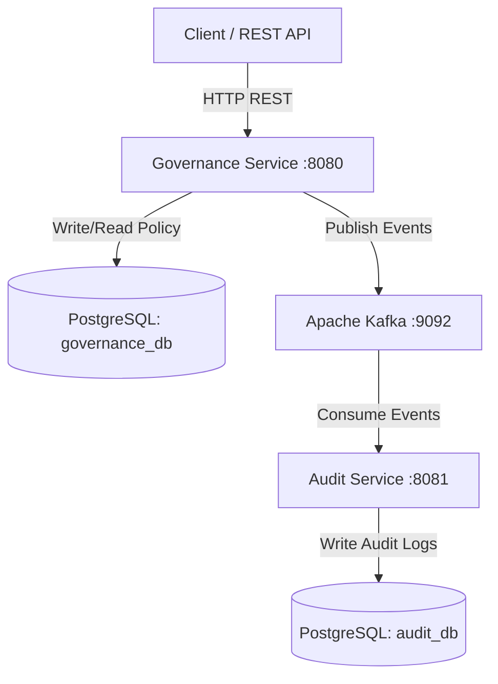

# Governance Policy Management System with Audit Logging

An event-driven microservices system designed for managing governance policies with automated asynchronous audit logging. Built with **Spring Boot 4.0.6**, **Java 21**, **Apache Kafka**, and **PostgreSQL**.

---

## 🏛️ System Architecture

The application is structured as a multi-module Maven project comprising two core microservices that communicate asynchronously via event-driven messaging:



### 1. Governance Service (Port `8080`)
- **Responsibility**: Manages the lifecycle of governance policies.
- **State Machine**: Policies progress through states: `DRAFT` ➡️ `PENDING_APPROVAL` ➡️ `APPROVED` / `REJECTED`.
- **Database**: Connects to the `governance_db` schema/database.
- **Event Producer**: Whenever a policy action occurs (created, submitted, approved, rejected), it publishes a payload of type `GovernanceEvent` to the Kafka topic `governance-events`.

### 2. Audit Service (Port `8081`)
- **Responsibility**: Receives events from the message broker to build a tamper-evident log trail.
- **Database**: Connects to the `audit_db` schema/database.
- **Event Consumer**: Subscribes to the `governance-events` Kafka topic. On receiving a message, it deserializes the payload and persists a new audit log entry containing the policy ID, actor, timestamp, and transition event type.

### 3. Messaging Infrastructure (Kafka & ZooKeeper)
- **ZooKeeper**: Coordinates Kafka brokers.
- **Kafka**: Decouples the Governance and Audit services. If the Audit Service is offline, Kafka buffers the events, preventing data loss and ensuring reliability.

### 4. Database Store (PostgreSQL)
- Dual databases run inside a single PostgreSQL container.
- `governance_db` maintains policies.
- `audit_db` maintains audit history logs.

---

## 🚀 Getting Started

### Prerequisites
Make sure you have the following installed on your machine:
- [Docker & Docker Compose](https://www.docker.com/)
- [Java Development Kit (JDK) 21](https://adoptium.net/) (if running locally outside Docker)
- [Maven](https://maven.apache.org/) (if running locally outside Docker)

---

### Run Configuration 1: Docker Compose (Recommended)

This compiles both microservices and boots up the database and Kafka messaging brokers in one command.

1. Clone or navigate to the repository directory.
2. Build and start all services:
   ```bash
   docker-compose up --build
   ```
3. Once running:
   - **Governance Service API**: `http://localhost:8080`
   - **Audit Service API**: `http://localhost:8081`
   - **PostgreSQL**: `localhost:5432`
   - **Kafka Broker**: `localhost:9092`

To stop the system, run:
```bash
docker-compose down -v
```

---

### Run Configuration 2: Hybrid Local Execution

You can run database and messaging brokers inside Docker containers while executing/debugging the Spring Boot services locally.

#### Step 1: Start Infrastructure Containers
Bring up PostgreSQL, ZooKeeper, and Kafka:
```bash
docker-compose up postgres-db zookeeper kafka -d
```

#### Step 2: Build the Maven Project
From the project root directory, run:
```bash
./mvnw clean install
```
*(On Windows command prompt, use `mvnw.cmd clean install`)*

#### Step 3: Run the Governance Service
Navigate to the `Governance_Service` directory and start the application:
```bash
cd Governance_Service
./mvnw spring-boot:run
```

#### Step 4: Run the Audit Service
In a separate terminal, navigate to the `Audit_Service` directory and start the application:
```bash
cd Audit_Service
./mvnw spring-boot:run
```

---

## 🧪 Testing the APIs

Here is a step-by-step walkthrough to test the end-to-end event-driven flow:

### 1. Create a Policy (Draft State)
Send a POST request to the Governance Service:
```bash
curl -X POST http://localhost:8080/policy \
  -H "Content-Type: application/json" \
  -d "{\"title\": \"Data Retention Policy\", \"description\": \"Keep user activity logs for 5 years.\", \"createdBy\": \"sec-admin\"}"
```
*Response Body:*
```json
{
  "id": 1,
  "title": "Data Retention Policy",
  "description": "Keep user activity logs for 5 years.",
  "status": "DRAFT",
  "createdBy": "sec-admin",
  "createdAt": "2026-06-02T20:45:00"
}
```

### 2. Submit the Policy for Approval
```bash
curl -X POST http://localhost:8080/policies/1/submit
```
*Expected Status*: `200 OK` (Status transitions to `PENDING_APPROVAL`).

### 3. Approve the Policy
```bash
curl -X POST http://localhost:8080/policies/1/approve
```
*Expected Status*: `200 OK` (Status transitions to `APPROVED`).

### 4. Fetch All Policies
```bash
curl http://localhost:8080/policies
```

### 5. Inspect the Audit Logs
Connect to the PostgreSQL database and select entries from the Audit Log table to verify that the Audit Service consumed the events and populated the audit records:
```bash
docker exec -it postgres-db psql -U postgres -d audit_db -c "SELECT * FROM audit_logs;"
```
You should see record rows listing the events:
- `policy_created`
- `policy_submitted`
- `policy_approved`
along with the matching policy ID, actor (`sec-admin`), and timestamps.