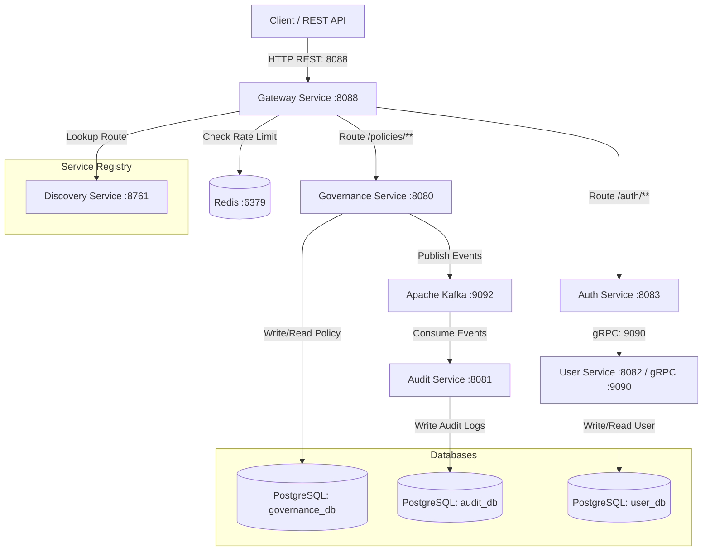

# Governance Policy Management System with Audit Logging

An event-driven microservices system designed for managing governance policies with automated asynchronous audit logging, gRPC-based user authentication, and Redis-backed API gateway rate limiting. Built with **Spring Boot 4.0.6**, **Java 21**, **Spring Cloud Gateway**, **gRPC**, **Apache Kafka**, **Redis**, and **PostgreSQL**.

---

## 🏛️ System Architecture

The application is structured as a multi-module microservices project comprising six specialized modules:



### Microservice Components
1. **Discovery Service (Port `8761`)**: Eureka service registry that enables microservices to register themselves dynamically for discovery and client-side load balancing.
2. **Gateway Service (Port `8088`)**: A Spring Cloud Gateway acting as the single entry point. It features:
   - Dynamic routing to downstream services registered in Eureka.
   - **Redis-backed Request Rate Limiting** with a custom IP-based key resolver.
   - Fault-tolerant configuration ensuring requests aren't dropped if client IP is not resolvable.
3. **Auth Service (Port `8083`)**: Handles authentication and registration. Verifies credentials and creates JWT tokens. Communicates with the `User Service` synchronously via **gRPC** for user storage and verification.
4. **User Service (Port `8082` / gRPC `9090`)**: Manages the persistence and lifecycle of user accounts. Exposes a high-performance gRPC server on port `9090` for inter-service communication and connects to `user_db`.
5. **Governance Service (Port `8080`)**: Manages the lifecycle of governance policies. Policies transition through states: `DRAFT` ➡️ `PENDING_APPROVAL` ➡️ `APPROVED` / `REJECTED`. Connects to `governance_db` and publishes `GovernanceEvent` messages to the Kafka topic `governance-events` when state transitions occur.
6. **Audit Service (Port `8081`)**: Connects to `audit_db`. Consumes event messages from the `governance-events` Kafka topic asynchronously and logs them into a tamper-evident audit table.

---

## ⚡ API Gateway & Request Rate Limiting

The **Gateway Service** uses a Redis-backed rate limiting filter to guard downstream services against DDoS and abuse:
* **Custom Resolver (`ipKeyResolver`)**: Resolves rate limiting keys based on the client's IP address (extracting from `X-Forwarded-For` header or connection metadata).
* **Fallback Behavior**: Configured with `spring.cloud.gateway.filter.request-rate-limiter.deny-empty-key: false` so that if a client's IP cannot be resolved, the request is still allowed to pass rather than being blocked.
* **Pre-configured Limits**:
  - `/auth/**`: Replenish rate: 5 requests/sec, Burst: 10 requests/sec.
  - `/policies/**`: Replenish rate: 20 requests/sec, Burst: 40 requests/sec.
  - Swagger & API Docs: Replenish rate: 30 requests/sec, Burst: 60 requests/sec.

---

## 🔒 gRPC Communication

`Auth Service` connects to `User Service` over a high-performance gRPC channel. The communication contract is defined in `user.proto`:

```protobuf
syntax = "proto3";
package user;

service UserService {
  rpc FindByUsername (UserRequest) returns (UserGrpcResponse);
  rpc RegisterUser (CreateUserGrpcRequest) returns (UserGrpcResponse);
}

message UserRequest {
  string username = 1;
}

message CreateUserGrpcRequest {
  string username = 1;
  string email = 2;
  string password = 3;
  Role role = 4;
}

enum Role {
  ADMIN = 0;
  USER = 1;
  AUDITOR = 2;
}

message UserGrpcResponse {
  string id = 1;
  string username = 2;
  string password = 3;
  string role = 4;
  string email = 5;
}
```

---

## ⚙️ Service Ports Map

| Service Name | Port | Database / Broker | Purpose |
| :--- | :--- | :--- | :--- |
| **Discovery Service** | `8761` | — | Service Registry (Eureka) |
| **Gateway Service** | `8088` | Redis (`6379`) | API Gateway & Load Balancer |
| **Auth Service** | `8083` | — | JWT Generation & Authentication |
| **User Service** | `8082` (REST) / `9090` (gRPC) | PostgreSQL (`user_db`) | User Management |
| **Governance Service** | `8080` | PostgreSQL (`governance_db`) | Policy Lifecycle Management |
| **Audit Service** | `8081` | PostgreSQL (`audit_db`) | Audit Logging Consumer |
| **Kafka Broker** | `9092` | — | Event Broker Messaging |
| **ZooKeeper** | `2181` | — | Kafka coordination |

---

## 🚀 Getting Started

### Prerequisites
Ensure you have the following installed:
* [Docker & Docker Compose](https://www.docker.com/)
* [Java Development Kit (JDK) 21](https://adoptium.net/)
* [Maven](https://maven.apache.org/)

---

### Step 1: Start Docker Infrastructure & Core Services
This spins up PostgreSQL, Redis, ZooKeeper, Kafka, and the dockerized core microservices:
```bash
docker-compose up --build
```
*(This creates `governance_db`, `audit_db`, and `user_db` schemas automatically inside the PostgreSQL container)*

---

### Step 2: Run User and Auth Services
Since `User_Service` and `Auth_Service` run outside of the default compose setup during active development, build and launch them in separate terminal sessions:

#### Run User Service:
```bash
cd User_Service
./mvnw clean spring-boot:run
```

#### Run Auth Service:
```bash
cd ../Auth_Service
./mvnw clean spring-boot:run
```

---

## 🧪 Testing the APIs

### 1. Register a New User
Send a POST request through the Gateway to register a user profile:
```bash
curl -X POST http://localhost:8088/auth/register \
  -H "Content-Type: application/json" \
  -d "{\"username\": \"sec-admin\", \"email\": \"admin@governance.com\", \"password\": \"securepassword\", \"role\": \"ADMIN\"}"
```

### 2. Login & Retrieve JWT Token
Obtain your authentication token:
```bash
curl -X POST http://localhost:8088/auth/login \
  -H "Content-Type: application/json" \
  -d "{\"username\": \"sec-admin\", \"password\": \"securepassword\"}"
```
*Expected Response:*
```json
{
  "token": "eyJhbGciOiJIUzI1NiJ9..."
}
```

### 3. Create a Policy (Draft State)
Send a POST request through the Gateway to the Governance Service:
```bash
curl -X POST http://localhost:8088/policies \
  -H "Content-Type: application/json" \
  -d "{\"title\": \"Data Retention Policy\", \"description\": \"Keep user activity logs for 5 years.\", \"createdBy\": \"sec-admin\"}"
```
*Expected Response:*
```json
{
  "id": 1,
  "title": "Data Retention Policy",
  "description": "Keep user activity logs for 5 years.",
  "status": "DRAFT",
  "createdBy": "sec-admin",
  "createdAt": "2026-06-08T23:00:00"
}
```

### 4. Submit the Policy for Approval
```bash
curl -X POST http://localhost:8088/policies/1/submit
```
*Expected Status*: `200 OK` (Status transitions to `PENDING_APPROVAL`).

### 5. Approve the Policy
```bash
curl -X POST http://localhost:8088/policies/1/approve
```
*Expected Status*: `200 OK` (Status transitions to `APPROVED`).

### 6. Inspect the Audit Logs
Connect to the PostgreSQL database and select entries from the Audit Log table to verify that the Audit Service consumed the events and populated the audit records:
```bash
docker exec -it postgres-db psql -U postgres -d audit_db -c "SELECT * FROM audit_logs;"
```
You should see record rows listing the events:
* `policy_created`
* `policy_submitted`
* `policy_approved`
along with the matching policy ID, actor (`sec-admin`), and timestamps.